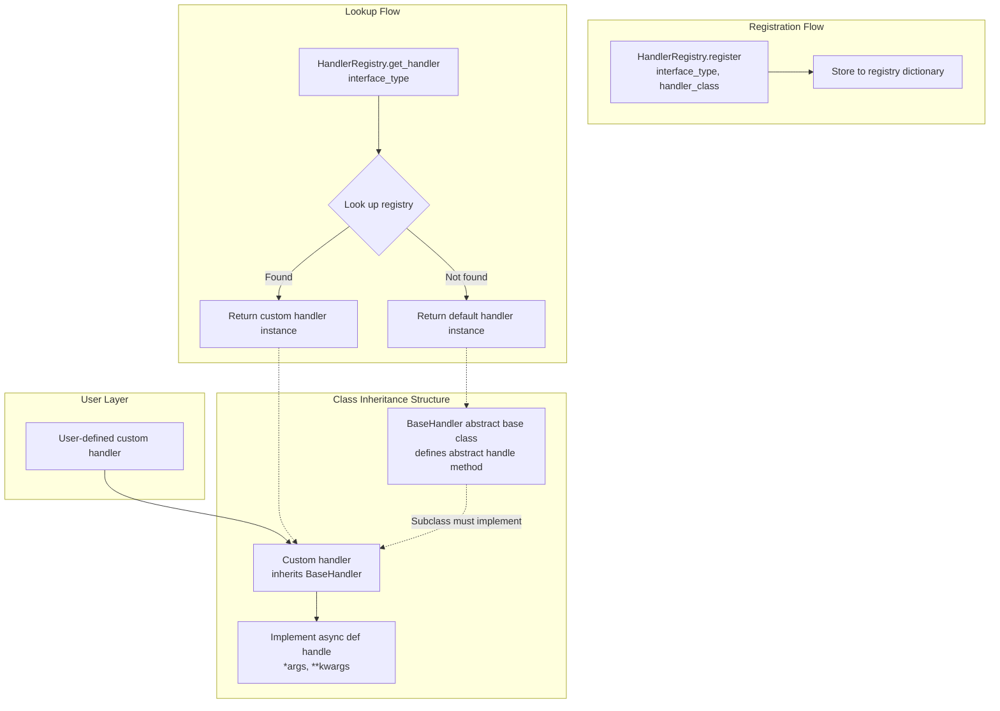

# Registry Center Development Guide

## Feature Overview

Registry Center is a service focused on unified Agent management, enabling users to centrally register and manage Agents from different vendors, achieving controlled access and maintenance of multi-source Agents. It is designed for unified AgentCard registration and management in multi-vendor, multi-agent interaction scenarios within the A2A-T domain.

## Constraints and Limitations

### Functional Limitations

- This project is intended as a functional module only, not a complete system. The module itself does not provide login authentication, authorization, user management, audit logging, encryption/decryption, key management, database, or other capabilities. These security infrastructures must be provided by the customer system. Hook methods have been reserved in the source code for secondary customization.
- By default, registered Agents are treated as public resources. There is currently no Agent owner design.
- AgentCards registered with this project must not contain personal data such as phone numbers, or sensitive information such as passwords or credentials, as doing so poses a risk of information leakage.
- This project only supports AgentCard registration in Chinese and English.
- Currently supports single-instance deployment, intended for internal systems only. It must not be exposed to the public internet and must not be deployed as a cloud service.

### Operational Limitations

1. The production environment for this project must run on a Linux system and supports IPv4 environments. Windows environments may be used for development and debugging; a warning log will be output at startup.

2. The maximum number of registered Agents defaults to 100 (configurable via `agent.num.max` in `etc/conf/server.properties`).

3. Request body size is limited to 1MB, and URL length is limited to 1KB.

4. Interface concurrency limits:
   - Registration interface: max 50 concurrent
   - Query interface: max 100 concurrent
   - Update interface: max 100 concurrent
   - Deregistration interface: max 50 concurrent
   - JWK interface: max 1 concurrent

5. Interface rate limiting:
   - Registration interface: 50 requests/second
   - Query interface: 100 requests/second
   - JWK interface: 10 requests/second

6. Custom handler registration timing:
   - Registration should be completed at application startup to avoid registering during business processing.

7. Custom LLM implementation timing:
   - Custom LLM implementations should be completed before application startup to avoid the custom LLM not being found after startup.

### Certificate Requirements

- server.cer: Required, identity certificate. Only PEM encoding format supported. RSA key length >= 3072 bits.
- server_key.pem: Required, private key file. Only PEM encoding format supported.
- cert_pwd: Required, private key passphrase file. Passphrase complexity must meet at least 8 characters and at least two character types.
- trust.cer: Required (when verify_client=true), trust certificate.
- National cryptographic (Guomi) certificates are not supported.

## Environment Preparation

### Environment Requirements

- OS: Linux (production environment); Windows for development and debugging
- Python Version: 3.10+
- Network: IPv4 environment
- Storage: Supports file storage, PostgreSQL (SQLite and GaussDB code reserved; the current initialization tool only supports file and postgresql)

### Setting Up the Environment

1. Obtain the source code

    ```bash
    git clone https://github.com/project-openan/registry-center.git
    cd registry-center
    ```

2. Create a virtual environment

    ```bash
    # Linux environment
    python3 -m venv myproject_env
    source myproject_env/bin/activate
    ```

3. Install dependencies

    ```bash
    pip install -r requirements.txt
    ```

4. Configure the service

    Run the initialization command for interactive configuration:

    ```bash
    python -m agent_registry.init
    ```

    Configuration items include:
    - HTTPS enable setting
    - TLS certificate path configuration
    - Signing certificate configuration
    - Signature verification toggle
    - Agent approval toggle
    - Storage mode configuration (file/postgresql)

    Configuration file paths:
    - Service configuration: `etc/conf/server.conf`
    - Persistence configuration: `etc/conf/persistence.conf`
    - LLM configuration: `common/config/llm_config.json` (see [Appendix 4](#appendix-4-llm-configuration-guide) for details)

5. Certificate preparation

    Place certificate files into the `etc/ssl/` directory:
    ```
    etc/ssl/server.cer      # Server identity certificate
    etc/ssl/server_key.pem  # Server private key
    etc/ssl/cert_pwd        # Private key passphrase file
    etc/ssl/trust.cer       # Trust certificate
    ```

    Set certificate file permissions:
    ```bash
    chmod 400 etc/ssl/*
    chmod 700 etc/ssl/
    ```

6. Configure the LLM

      The Registry Center relies on an LLM for intelligent Agent selection and an Embedding model for vector retrieval. Edit `common/config/llm_config.json`:
    
     ```json
     {
       "chat": {
         "description": "Chat/LLM model for agent operations",
         "model": "Qwen3_32B",
         "url": "http://AOC_HOST:PORT/aoc/openapi/YOUR_CHAT_ENDPOINT",
         "api_key": "dummy",
         "enable_thinking": false,
         "auth": {
           "type": "aoc_signed",
           "app_key": "YOUR_APP_KEY",
           "app_secret": "YOUR_APP_SECRET",
           "authorization": "Bearer YOUR_BEARER_TOKEN",
           "api_code": "YOUR_API_CODE"
         },
         "body": {
           "model": "$MODEL",
           "messages": [{"role": "user", "content": "$PROMPT"}],
           "chat_template_kwargs": {"enable_thinking": "$ENABLE_THINKING"}
         },
         "response": {
           "answer": "choices.0.message.content",
           "reasoning": "choices.0.message.reasoning_content"
         }
       },
       "embed": {
         "description": "Embedding model for vector similarity",
         "model": "bge-m3",
         "url": "http://AOC_HOST:PORT/aoc/openapi/YOUR_EMBED_ENDPOINT",
         "api_key": "dummy",
         "enable_thinking": false,
         "auth": {
           "type": "aoc_signed",
           "app_key": "YOUR_APP_KEY",
           "app_secret": "YOUR_APP_SECRET",
           "authorization": "Bearer YOUR_BEARER_TOKEN",
           "api_code": "YOUR_API_CODE"
         },
         "body": { "model": "$MODEL", "input": "$PROMPT" },
         "response": { "embedding": "data.0.embedding" }
       },
       "rerank": {
         "description": "Reranker model for result reordering",
         "model": "bge-reranker-v2-m3",
         "url": "http://AOC_HOST:PORT/aoc/openapi/interface/bge-reranker-v2-m3",
         "api_key": "dummy",
         "enable_thinking": false,
         "auth": {
           "type": "aoc_signed",
           "app_key": "YOUR_APP_KEY",
           "app_secret": "YOUR_APP_SECRET",
           "authorization": "Bearer YOUR_BEARER_TOKEN",
           "api_code": "YOUR_API_CODE"
         },
         "body": { "model": "$MODEL", "query": "$QUERY", "documents": "$DOCUMENTS" },
         "response": { "results": "results" }
       }
     }
     ```
    
     Replace the placeholder values (`YOUR_*`) with actual configuration. For detailed field descriptions, see [Appendix 4: LLM Configuration Guide](#appendix-4-llm-configuration-guide).

7. Verify the environment setup

    Start the service and check the logs:
    
    ```bash
    nohup python -m agent_registry.start > agent_registry.log 2>&1 &
    tail -f agent_registry.log
    ```
    
    The following log indicates successful startup:
    ```
    Uvicorn running on https://127.0.0.1:5000
    ```
    
    Verify that the LLM configuration loaded successfully:
    
     ```bash
     python -c "from common.llm import get_llm_instance, get_embed_instance; print(get_llm_instance().to_dict()); print(get_embed_instance().to_dict())"
     ```

## Agent Registration Scenario

### Use Case Overview

This scenario describes how to register an Agent with the Registry Center, including AgentCard construction, signature verification flow, and post-registration management.

### System Architecture

The Registry Center system architecture is as follows:

```
┌─────────────────────────────────────────────────────────────────┐
│                     Client (Agent Provider)                      │
│  ┌─────────────┐    ┌─────────────┐    ┌─────────────────┐       │
│  │ AgentCard   │ -> │ Signature   │ -> │ REST API        │       │
│  │ Construction│    │ Generation  │    │ Request         │       │
│  └─────────────┘    └─────────────┘    └─────────────────┘       │
└─────────────────────────────────────────────────────────────────┘
                              │
                              │ HTTPS/TLS
                              ▼
┌─────────────────────────────────────────────────────────────────┐
│                   Registry Center Service                        │
│  ┌─────────────┐    ┌─────────────┐    ┌─────────────────┐       │
│  │ TLS         │ -> │ Signature   │ -> │ Security Check  │       │
│  │ Verification│    │ Verification│    │ (Prompt Inject, │       │
│  │             │    │             │    │  etc.)          │       │
│  └─────────────┘    └─────────────┘    └─────────────────┘       │
│                              │                                   │
│                              ▼                                   │
│  ┌─────────────┐    ┌─────────────┐    ┌─────────────────┐       │
│  │ Agent       │ -> │ Persistence │ -> │ Approval Flow   │       │
│  │ Registry    │    │             │    │ (Optional)      │       │
│  └─────────────┘    └─────────────┘    └─────────────────┘       │
└─────────────────────────────────────────────────────────────────┘
                              │
                              ▼
┌─────────────────────────────────────────────────────────────────┐
│                       Storage Layer                              │
│  ┌─────────────┐    ┌─────────────┐    ┌─────────────────┐       │
│  │ File        │    │ PostgreSQL  │    │ VectorDB        │       │
│  │ (Default)   │    │             │    │ (Optional)      │       │
│  └─────────────┘    └─────────────┘    └─────────────────┘       │
└─────────────────────────────────────────────────────────────────┘
```

Core Component Description:
- **Agent Registry**: Core registration logic, manages CRUD operations for AgentCards
- **AgentCardSignatureValidator**: Signature verification component
- **JWKProvider**: Public key provision component, used for signature verification
- **Persistence**: Persistence layer, supports multiple storage modes

### Development Flow

Agent registration development flow:

```
1. Build AgentCard
      │
      ▼
2. Generate AgentCard Signature (Optional)
      │
      ▼
3. Configure Verification Public Key (if signature verification is enabled)
      │
      ▼
4. Send Registration Request
      │
      ▼
5. Verify Registration Result
```

### Interface Description

**Table 1** Primary Interface List

| Interface | Description |
|-----------|-------------|
| POST /rest/v1/registry-center/agent-cards | Register AgentCard |
| GET /rest/v1/registry-center/agent-cards | Query AgentCard list |
| GET /rest/v1/registry-center/agent-cards/{org}/{name} | Query a specific AgentCard |
| PUT /rest/v1/registry-center/agent-cards/{org}/{name} | Update a specific AgentCard |
| DELETE /rest/v1/registry-center/agent-cards/{org}/{name} | Delete a specific AgentCard |
| POST /rest/v1/registry-center/agent-cards/semantic-query | Semantic search for AgentCards |
| GET /rest/v1/registry-center/keys | Get public key information |

For detailed interface parameters, please refer to [Registry Center API Reference](./Registry Center API Reference.md).

### Development Steps

1. Build an AgentCard

    An AgentCard is the description information of an Agent, containing the following core fields:
    
    ```python
    from a2a.types import AgentCard, AgentProvider, AgentSkill, AgentCapabilities, AgentInterface
    
    agent_card = AgentCard(
        name="RAN Energy Saving Agent",
        description="Responsible for autonomous closed-loop RAN energy efficiency optimization, including intent exploration, intent implementation, effect evaluation and reporting.",
        version="1.0.0",
        provider=AgentProvider(
            organization="Huawei",
            url="https://www.huawei.com"
        ),
        skills=[
            AgentSkill(
                id="ran-es-intent-exploration",
                name="RAN ES Intent Exploration",
                description="Evaluate and determine the best feasibility for a given RAN ES intent target",
                tags=["wireless", "energy-saving", "intent"]
            )
        ],
        capabilities=AgentCapabilities(
            streaming=True,
            push_notifications=False
        ),
        supported_interfaces=[
            AgentInterface(
                protocol_binding="GRPC",
                protocol_version="1.0.0",
                url="http://127.0.0.1:5000/"
            )
        ]
    )
    ```

    Notes:
    - The combination of `name` and `provider.organization` serves as the unique identifier and cannot be registered more than once.
    - `description` length limit: 1~1000 characters.
    - `skills`: maximum 100, each skill description up to 4096 characters.
    - Prompt injection keywords and high-risk skill descriptions are prohibited. See [AgentCard Security Specification](../../design/AgentCard_Security_Specification.md) for details.

2. Generate a signature (optional)

    If signature verification is required, generate a signature for the AgentCard:

    ```python
    from a2a.utils.signing import create_signer
    from cryptography.hazmat.primitives import serialization
    
    # Load private key
    with open("sign_key.pem", "rb") as f:
        private_key = serialization.load_pem_private_key(f.read(), password=None)
    
    # Create signer and sign
    signer = create_signer(private_key, "RS256")
    signed_agent_card = signer(agent_card)
    ```

    Signature requirements:
    - Supported algorithms: RS256, ES256
    - The corresponding public key must be configured at `etc/sign_verify/jwks/{org}/{agent_name}.json` in the Registry Center

3. Configure the verification public key

    Configure the verification public key in the Registry Center:
    
    ```bash
    # Public key file format: JWK Set
    mkdir -p etc/sign_verify/jwks/Huawei
    cat > etc/sign_verify/jwks/Huawei/TestAgent.json << 'EOF'
    {
      "keys": [
        {
          "kty": "RSA",
          "n": "base64url-encoded-modulus",
          "e": "AQAB",
          "alg": "RS256",
          "use": "sig",
          "kid": "test-key-1"
        }
      ]
    }
    EOF
    ```

4. Send a registration request

    Use HTTPS to send the registration request:
    
    ```python
    import requests
    import json
    
    # Serialize AgentCard
    agent_dict = {
        "name": "RAN Energy Saving Agent",
        "description": "Responsible for autonomous closed-loop RAN energy efficiency optimization",
        "version": "1.0.0",
        "provider": {"organization": "Huawei", "url": ""},
        "skills": [...],
        "capabilities": {"streaming": True, "push_notifications": False},
        "supported_interfaces": [...]
    }
    
    # Send request
    response = requests.post(
        "https://127.0.0.1:5000/rest/v1/registry-center/agent-cards",
        json={"agentCards": [agent_dict]},
        cert=("client.cer", "client_key.pem"),  # Client certificate
        verify="trust.cer"  # Trust certificate
    )
    
    print(f"Status: {response.status_code}")
    ```

5. Verify the registration result

    Query the registered Agent:
    
    ```python
    # Query a specific Agent
    response = requests.get(
        "https://127.0.0.1:5000/rest/v1/registry-center/agent-cards/Huawei/RAN%20Energy%20Saving%20Agent",
        cert=("client.cer", "client_key.pem"),
        verify="trust.cer"
    )
    
    agent_data = response.json()
    print(json.dumps(agent_data, indent=2))
    ```

### Testing and Verification

#### Verify Service Status

```bash
# View service logs
tail -f agent_registry.log

# View registration count
curl -k --cert client.cer --key client_key.pem \
  https://127.0.0.1:5000/rest/v1/registry-center/agent-cards
```

#### Verify Signature Functionality

```bash
# Get Registry Center public key
curl -k https://127.0.0.1:5000/rest/v1/registry-center/keys

# Verify AgentCard signature validity (test via registration interface)
```

#### Verify Storage Status

```bash
# File storage mode: view data files
cat data/agentcard.json
cat data/agentregistry.json
cat data/tags.json
```

## Semantic Search Scenario

### Use Case Overview

The semantic search scenario is used to intelligently match the most suitable Agent based on natural language task descriptions.

### Development Flow

```
1. Build Task Description
      │
      ▼
2. Send Semantic Search Request
      │
      ▼
3. Retrieve Matching Agent List
```

### Development Steps

1. Build a task description

    The task description should be in natural language, describing the task to be completed:

    ```json
    {
      "task": "Need to query intent reports"
    }
    ```

2. Send a search request

    ```python
    import requests

    response = requests.post(
        "https://127.0.0.1:5000/rest/v1/registry-center/agent-cards/semantic-query",
        json={"task": "Need to query intent reports"},
        cert=("client.cer", "client_key.pem"),
        verify="trust.cer"
    )
    ```

3. Process the search results

    ```python
    result = response.json()
    for agent in result.get("agentCards", []):
        print(f"Agent: {agent['name']}")
        print(f"Description: {agent['description']}")
    ```

    Notes:
    - Search is based on semantic matching of the Agent's description and skills.
    - An LLM is used for intelligent filtering.
    - Returns a maximum of top_n matching results.

## CLI Management Scenario

### Use Case Overview

The Registry Center provides a CLI command-line tool for local management of Agents and tags.

### Development Steps

1. Launch the CLI

    ```bash
    python -m agent_registry.cli
    ```

2. Agent management commands

    ```bash
    # Query Agent list
    registry agent list

    # Query Agent details
    registry agent get --name "RAN Energy Saving Agent" --org "Huawei"

    # Approve an Agent (requires approval feature to be enabled)
    registry agent approve --name "RAN Energy Saving Agent" --org "Huawei"
    ```

3. Tag management commands

    ```bash
    # Create a tag
    registry tag create --name "wireless"

    # Query tag list
    registry tag list

    # Set tags for an Agent
    registry agent set-tags -n "RAN Energy Saving Agent" -o "Huawei" -t "wireless,energy-saving"

    # Delete a tag
    registry tag delete --id "tag-uuid"
    ```

    Notes:
    - The CLI communicates with the service via Unix Domain Socket. UDS is not available on Windows, so internal CLI commands are limited.
    - Socket path (Linux): `run/registry-center/internal.sock`.

## Configuration Extension Scenario

### Use Case Overview

Implement custom functionality through extended configuration, including storage mode switching and security policy configuration.

### Development Steps

1. Switch storage mode

    Modify `etc/conf/persistence.conf`:

    ```properties
    # File storage mode
    persistence.mode=file

    # PostgreSQL storage mode
    persistence.mode=postgresql
    postgresql.host=127.0.0.1
    postgresql.port=5432
    postgresql.name=registry_center
    postgresql.username=postgres
    postgresql.password=<encrypted_password>
    ```

2. Configure security policy

    Modify `etc/conf/server.conf`:

    ```properties
    # Signature verification toggle
    signature_validation_enabled=true

    # Agent approval toggle
    agent_approval_enabled=true

    # Owner isolation toggle
    owner.isolation.enabled=true
    owner.validation.mode=relaxed
    ```

3. Configure vector database

    ```properties
    # Enable vector database (for semantic search optimization)
    use_vectordb=true
    ```

## Custom Interface Extension Scenario

### Use Case Overview

This scenario describes how to extend Registry Center functionality through custom interfaces, including two extension approaches: custom handlers and custom large language models (LLMs). Through unified abstract base classes and a handler registration mechanism, developers can flexibly extend system functionality without modifying core code.

### System Architecture

The custom interface system architecture is as follows:

**Custom Handler Architecture:**

The system adopts the registry pattern, with core components shown in Table 2:

**Table 2** Interface Extension Core Components

| Component | Responsibility |
|-----------|----------------|
| BaseHandler | Defines the unified abstract interface for all handlers |
| HandlerRegistry | Manages handler registration and retrieval, provides default implementation as fallback |
| InterfaceType | Defines supported interface type enumerations |
| Default Handlers | Provide built-in implementations for common operations |
| Custom Handlers | User-extended implementations that override default behavior |

```
┌─────────────────┐
│  Business Caller │
└────────┬────────┘
         │
         ▼
┌─────────────────┐
│ HandlerRegistry │◄──── Register custom handlers
└────────┬────────┘
         │
         ▼
┌─────────────────┐
│   BaseHandler   │
│ (Abstract Base) │
└────────┬────────┘
     ┌───┴───┬───────────────┐
     ▼       ▼               ▼
┌───────┐ ┌───────┐  ┌───────────┐
│Default│ │Default│  │  Custom   │
│Handler│ │Handler│  │  Handler  │
│   1   │ │   2   │  │     3     │
└───────┘ └───────┘  └───────────┘
```

**Figure 1** Handler Invocation Flow



**Custom LLM Architecture:**

The system adopts the registry pattern and decorator pattern, with core components shown in Table 3:

**Table 3** LLM Architecture Core Components

| Component | Responsibility |
|-----------|----------------|
| BaseLLM | Defines the abstract base class for all LLMs, provides a unified invocation interface |
| LLMProviderRegistry | Manages LLM provider registration, supports decorator-based registration |
| LLMType | Defines supported LLM type enumerations |
| LLMConfig/LLMConfigItem | Manages LLM configuration information (model, API, keys, etc.) |
| Default LLM Implementations | OpenAIStyleLLM, AOCChatLLM, and other built-in implementations |
| Custom LLMs | User-extended implementations, supporting integration of any vendor |

```
┌─────────────────────┐
│   Business Caller    │
└──────────┬──────────┘
           │
           ▼
┌─────────────────────┐
│   get_llm_instance  │
└──────────┬──────────┘
           │
           ▼
┌─────────────────────┐
│ LLMProviderRegistry │◄──── @registry_provider register custom LLM
└──────────┬──────────┘
           │
           ▼
┌─────────────────────┐
│      BaseLLM        │
│  (Abstract Base)    │
└──────────┬──────────┘
     ┌──────┴──────┬───────────────┐
     ▼             ▼               ▼
┌─────────┐ ┌──────────┐  ┌─────────────┐
│OpenAI   │ │  AOC     │  │  Custom     │
│StyleLLM │ │ ChatLLM  │  │  MyLLM      │
└─────────┘ └──────────┘  └─────────────┘
```

**Directory Structure:**
```
{install_dir}/registry-center/
├── common/
│   ├── config/
│   │      └── llm_config.json      # LLM configuration file
│   ├── llm/
│   │   ├── config/
│   │   │      ├── __init__.py
│   │   │      ├── config_reader.py # Reads configuration file
│   │   │      └── llm_config.py    # LLMType and LLMConfig class file
│   │   ├── provider/
│   │   │      ├── __init__.py
│   │   │      ├── base_llm.py              # Base class
│   │   │      ├── llm_provider_registry.py # Registry
│   │   │      ├── llm_openai.py            # OpenAI style LLM implementation
│   │   │      ├── aoc_base_llm.py          # AOC base class
│   │   │      ├── aoc_chat_llm.py          # AOC chat model
│   │   │      ├── aoc_embedding_llm.py     # AOC embedding model
│   │   │      └── aoc_reranker_llm.py      # AOC reranker model
│   │   ├── __init__.py    # Module export file
│   │   └── llm.py         # Get LLM instance
│   └── custom/
│          ├── interface_type.py    # Interface type enumeration
│          └── custom_handle.py     # Handler base class and registry
```

### Custom Handler Usage

#### Feature Description

**Core Capabilities:**
- **Abstract Base Class**: Defines a unified interface for all handlers
- **Default Implementations**: Provides built-in handlers for common operations
- **Custom Extensions**: Supports users registering custom handlers

#### When to Use Custom Handlers

The following scenarios require users to implement their own custom handlers:

**Table 4** Custom Handler Implementation Scenarios

| Scenario | Description | Example |
|----------|-------------|---------|
| Custom decryption logic | When a non-default decryption method is needed, implement a custom handler for the decryption logic | Using a specific encryption algorithm for decryption |
| Custom audit logging | When audit logs need to be stored to a specific storage medium or extra information added | Storing audit logs to ELK or a database |
| Custom authentication | When integrating with a specific authentication system | Integrating LDAP, OAuth, or other authentication systems |
| Custom storage logic | When a specific storage medium is needed for Agent data | Using MySQL, MongoDB, etc. to store Agent data |

#### Development Steps

1. Create `__init__.py` and `my_custom_handle.py` files in the `common/custom` directory.

2. Create custom handlers in `my_custom_handle.py`

    Create a custom class inheriting from BaseHandler and implement the handle method:
    ```python
    from common.custom.custom_handle import BaseHandler

    class MyCustomDecryptHandle(BaseHandler):
        """Custom decryption handler"""
        
        async def handle(self, *args, **kwargs):
            """
            Custom decryption logic
            
            Args:
                *args: Positional arguments
                **kwargs: Keyword arguments
                
            Returns:
                Decryption result
            """
            # Custom implementation
            result = "custom result"
            return result

    class MyCustomAuditHandle(BaseHandler):
        """Custom audit handler"""
        
        async def handle(self, *args, **kwargs):
            # Custom implementation
            return "custom result"
    ```

3. Register custom handlers in `__init__.py`

    Register custom handlers at application startup:
    ```python
    from common.custom.custom_handle import HandlerRegistry
    from common.custom.interface_type import InterfaceType
    from common.custom.my_custom_handle import MyCustomDecryptHandle
    from common.custom.my_custom_handle import MyCustomAuditHandle

    # Register custom handlers
    # Note: Registration should be completed before business processing begins
    HandlerRegistry.register(InterfaceType.DECRYPT, MyCustomDecryptHandle)
    HandlerRegistry.register(InterfaceType.AUDIT, MyCustomAuditHandle)
    ```

    > **Note**: If multiple custom handlers are registered for the same interface, the later registration will override the previous one. Please ensure the registration order matches expectations.

4. Use the handler

    Retrieve and use the handler in business code:
    ```python
    from common.custom.custom_handle import HandlerRegistry
    from common.custom.interface_type import InterfaceType

    # Get handler instance
    # HandlerRegistry automatically returns the registered custom handler or default implementation
    handle = HandlerRegistry.get_handler(InterfaceType.QUERY)

    # Use the handler to execute business logic
    result = await handle.handle(...)
    ```

    > **Note**: The above flow is automatically managed by the framework. In actual usage, you only need to call the unified business interface without worrying about how handlers are selected and executed.

#### Default Handler Description

If no custom handler is registered, the system uses the following default implementations:

**Table 5** Default Handler Description

| Handler | Interface Type | Description | Parameter Description |
|---------|---------------|-------------|-----------------------|
| DecryptHandler | DECRYPT | Handles decryption operations | `ciphertext: str` Ciphertext to be decrypted |
| AuditHandler | AUDIT | Handles audit logging | `log_entry: Dict` containing operation_name, level, result, object_name, details, client_ip, user_name |
| AuthenticateHandler | AUTHENTICATE | Handles authentication | `client_ip: str`, `request: Any`, `context: Dict` (optional) |
| InsertHandler | INSERT | Handles Agent data saving | `agent: AgentCard`, `initial_status: str` (kwargs), `owner: str` (kwargs) |
| QueryHandler | QUERY | Handles Agent data querying | `name: str` (optional), `organization: str` (optional) |
| UpdateHandler | UPDATE | Handles Agent data modification | `name: str`, `organization: str`, `agent_data: Dict`, `owner: str` (kwargs) |
| GetHandler | GET | Handles precise Agent queries | `name: str`, `organization: str`, `owner: str` (kwargs) |
| RetrieveHandler | RETRIEVE | Handles Agent retrieval | `task: str`, `top_n: int` |
| DeregisterHandler | DEREGISTER | Handles Agent deletion | `name: str`, `organization: str`, `owner: str` (kwargs) |

#### Testing and Verification

Verify default handler:
```python
from common.custom.custom_handle import HandlerRegistry
from common.custom.interface_type import InterfaceType

# Verify default handler
handler = HandlerRegistry.get_handler(InterfaceType.QUERY)
assert handler is not None, "Failed to get handler"
print(f"Currently used handler: {type(handler).__name__}")
```

Verify custom handler registration:
```python
from common.custom.custom_handle import BaseHandler, HandlerRegistry
from common.custom.interface_type import InterfaceType

class TestHandle(BaseHandler):
    async def handle(self, *args, **kwargs):
        return "test_success"

# Before registration
handler_before = HandlerRegistry.get_handler(InterfaceType.INSERT)
print(f"Before registration: {type(handler_before).__name__}")

# Register
HandlerRegistry.register(InterfaceType.INSERT, TestHandle)

# After registration
handler_after = HandlerRegistry.get_handler(InterfaceType.INSERT)
print(f"After registration: {type(handler_after).__name__}")

# Verify functionality
result = await handler_after.handle()
assert result == "test_success", "Custom handler did not take effect"
print("Verification passed")
```

### Custom LLM Usage

#### Feature Description

**Core Capabilities:**
- **Abstract Base Class**: Defines a unified interface for all LLM implementations (`BaseLLM`)
- **Registry Mechanism**: Manages LLM provider registration and retrieval via the decorator pattern
- **Configuration-Driven**: Manages connection parameters for different LLMs based on JSON configuration files
- **Instance Caching**: Singleton pattern manages LLM instances to avoid redundant creation

#### When to Use Custom LLMs

The following scenarios require users to implement their own custom LLMs:

**Table 6** Custom LLM Scenario Description

| Scenario | Description | Example |
|----------|-------------|---------|
| Non-OpenAI style API | When using vendor models that do not support the OpenAI API format, customize the LLM implementation for corresponding request and response parsing logic | Baidu Wenxin Yiyan, iFlytek Spark, and other domestic vendor models |
| Special authentication method | When the LLM API requires non-standard API Key authentication (e.g., OAuth, custom signatures, multi-layer authentication), customize the LLM to handle the authentication flow | A private deployment platform requiring OAuth 2.0 authentication |
| Privately deployed LLM | When using a privately deployed LLM whose API interface format is incompatible with OpenAI, customize the LLM to adapt to the private interface | An internally deployed LLaMA model service within an enterprise |
| Special request format | When the LLM API requires special request parameter structures or response formats, customize the LLM to handle request construction and response parsing | Model requiring custom prompt templates or special parameters |

**Decision Criteria:**

- If the LLM API is compatible with the OpenAI API format (e.g., DeepSeek, GPT-4, Claude, etc.), directly use the default `OpenAIStyleLLM` without customization
- If the LLM API is not compatible with the OpenAI API format, implement a custom LLM

#### Development Steps

**Step 1**: Modify the configuration file `llm_config.json`

Configuration file path: `common/config/llm_config.json`

Add a new LLM configuration entry in the configuration file:
```json
{
  "openai_style_llm": {
    "description": "Large language model in OpenAI style",
    "model": "your-model-name",
    "enable_thinking": true,
    "api": "https://your-openai-style-api-endpoint.com",
    "api_key": "<YOUR_API_KEY>"
  },
  "my_custom_llm": {
    "description": "My custom LLM",
    "model": "custom-model-name",
    "enable_thinking": true,
    "api": "https://your-api-endpoint.com/v1",
    "api_key": "your-custom-api-key",
    "extra": {
      "custom_param1": "value1",
      "custom_param2": "value2"
    }
  }
}
```

**Step 2**: Add the new type to the LLMType enumeration

Edit `common/llm/config/llm_config.py`:
```python
from enum import Enum

class LLMType(Enum):
    OPENAI_STYLE_LLM = "openai_style_llm"
    AOC_CHAT_LLM = "aoc_chat_llm"
    AOC_EMBEDDING_LLM = "aoc_embedding_llm"
    AOC_RERANKER_LLM = "aoc_reranker_llm"
    MY_CUSTOM_LLM = "my_custom_llm"  # New custom type
```

**Step 3**: Create the custom LLM implementation file

Create `my_custom_llm.py` in the `common/llm/provider/` directory:
```python
from typing import Union, Tuple
from common.llm.config.llm_config import LLMType, LLMConfig
from common.llm.provider.base_llm import BaseLLM
from common.llm.provider.llm_provider_registry import registry_provider

@registry_provider(LLMType.MY_CUSTOM_LLM)
class MyCustomLLM(BaseLLM):
    
    def __init__(self, llm_config: LLMConfig):
        super().__init__(llm_config)
        # Initialize custom client
        self.client = {}  # Implement based on actual situation
    
    def _ask_llm(self, prompt: str) -> Union[str, Tuple[str, str]]:
        """
        Call custom API
        
        Args:
            prompt: Input prompt text
            
        Returns:
            If enable_thinking is True, returns (reasoning, answer) tuple
            Otherwise returns answer string
        """
        # Call custom API, example only, modify implementation based on actual situation
        response = self.client.generate(
            model=self.model,
            prompt=prompt,
            enable_thinking=self.enable_thinking
        )
        
        # Handle based on API response format
        if self.enable_thinking and hasattr(response, 'reasoning'):
            reasoning = response.reasoning
            answer = response.content
            return reasoning, answer
        else:
            return response.content
```

**Step 4**: Export the new class in `common/llm/__init__.py`

```python
from .llm import get_llm_instance
from .provider.llm_openai import OpenAIStyleLLM
from .provider.aoc_chat_llm import AOCChatLLM
from .provider.aoc_embedding_llm import AOCEmbeddingLLM
from .provider.aoc_reranker_llm import AOCRerankerLLM
from .provider.my_custom_llm import MyCustomLLM  # New export

__all__ = ["OpenAIStyleLLM",
           "get_llm_instance",
           "AOCChatLLM",
           "AOCEmbeddingLLM",
           "AOCRerankerLLM",
           "MyCustomLLM"
           ]
```

#### Default LLM Description

If no custom LLM is registered, the system provides the following default implementations:

**Table 7** Default LLM Description

| LLM Implementation | Corresponding Type | Description |
|--------------------|-------------------|-------------|
| OpenAIStyleLLM | OPENAI_STYLE_LLM | Supports LLM invocation via OpenAI-style API |
| AOCChatLLM | AOC_CHAT_LLM | AOC platform chat model (e.g., Qwen3_32B) |
| AOCEmbeddingLLM | AOC_EMBEDDING_LLM | AOC platform embedding model (e.g., BGE-M3) |
| AOCRerankerLLM | AOC_RERANKER_LLM | AOC platform reranker model (e.g., BGE-Reranker-v2-m3) |

#### Using a Custom LLM

**Method 1**: Modify the default parameter

Modify the default parameter of the `get_llm_instance` function in `common/llm/llm.py`:
```python
from common.llm.config.llm_config import get_llm_config_by_type, LLMType
from common.llm.provider.llm_provider_registry import get_or_create_llm_instance

def get_llm_instance(llm_type: LLMType = LLMType.MY_CUSTOM_LLM):
    return get_or_create_llm_instance(get_llm_config_by_type(llm_type))
```

**Method 2**: Explicitly pass the type
```python
from common.llm import get_llm_instance
from common.llm.config.llm_config import LLMType

# Use custom LLM
llm = get_llm_instance(LLMType.MY_CUSTOM_LLM)
result = llm.ask_llm("Hello, please introduce yourself")
print(result)
```

#### Testing and Verification

Verify default LLM:
```python
from common.llm import get_llm_instance
from common.llm.config.llm_config import LLMType

# Verify default LLM availability
llm = get_llm_instance(LLMType.AOC_CHAT_LLM)
assert llm is not None, "Failed to get LLM instance"
print(f"Currently used LLM: {llm.to_dict()}")
```

Verify custom LLM registration:
```python
from common.llm import get_llm_instance
from common.llm.config.llm_config import LLMType, LLMConfig
from common.llm.provider.base_llm import BaseLLM
from common.llm.provider.llm_provider_registry import registry_provider

@registry_provider(LLMType.MY_CUSTOM_LLM)
class TestLLM(BaseLLM):
    def _ask_llm(self, prompt: str):
        return "test_response"

# Use custom LLM
llm = get_llm_instance(LLMType.MY_CUSTOM_LLM)
result = llm.ask_llm("Test question")
assert "test_response" in result, "Custom LLM did not take effect"
print("Verification passed")
```

## Appendix

### Appendix 1: Configuration File Description

#### server.conf Configuration Items

**Table 8** server.conf Configuration Item Description

| Configuration Item | Description | Default Value           |
|--------------------|-------------|-------------------------|
| IP | Service listening IP | 127.0.0.1               |
| PORT | Service listening port | 5000                    |
| enable_https | Enable HTTPS | true                    |
| ssl_certfile | Service certificate path | etc/ssl/server.cer      |
| ssl_keyfile | Service private key path | etc/ssl/server_key.pem  |
| ssl_keyfile_password | Private key passphrase file path | etc/ssl/cert_pwd        |
| ssl_ca_certs | Trust certificate path | etc/ssl/trust.cer       |
| verify_client | Verify client certificate | true                    |
| signature_validation_enabled | Signature verification toggle | true                    |
| agent_approval_enabled | Agent approval toggle | false                   |
| owner.isolation.enabled | Owner isolation toggle | true                    |
| use_vectordb | Enable vector database | false                   |
| jwk_cert_path | JWK signing certificate path | etc/ssl/server.cer |
| jwk_private_key_path | JWK private key directory | etc/sign_cert |
| jwk_private_key_password | JWK private key passphrase | '' |
| registry.sign.enabled | Registry Center signing toggle | true |

#### persistence.conf Configuration Items

**Table 9** persistence.conf Configuration Item Description

| Configuration Item | Description | Default Value |
|--------------------|-------------|---------------|
| persistence.mode | Storage mode | file |
| postgresql.host | PostgreSQL host | 127.0.0.1 |
| postgresql.port | PostgreSQL port | 5432 |
| postgresql.name | Database name | registry_center |

#### server.properties Configuration Items (Advanced)

 The following configuration is in `etc/conf/server.properties`:

**Table 10** server.properties Configuration Item Description

| Configuration Item | Description | Default Value |
|--------------------|-------------|---------------|
| tls.version | TLS protocol version | TLSv1.3,TLSv1.2 |
| tls.cipher | TLS cipher suite list | See config file |
| connection.max | Maximum connections | 500 |
| connection.timeout | Connection timeout (seconds) | 300 |
| agent.num.max | Agent registration limit | 100 |
| tag.max.count | Agent tag count limit | 10 |
| tag.max.length | Tag name length limit | 50 |
| flowcontrol.ratelimit.register | Registration interface rate limit (req/sec) | 50 |
| flowcontrol.ratelimit.query | Query interface rate limit (req/sec) | 100 |
| flowcontrol.ratelimit.update | Update interface rate limit (req/sec) | 100 |
| flowcontrol.ratelimit.get | Get single rate limit (req/sec) | 100 |
| flowcontrol.ratelimit.retrieve | Semantic search rate limit (req/sec) | 100 |
| flowcontrol.ratelimit.deregister | Deregistration interface rate limit (req/sec) | 50 |
| flowcontrol.ratelimit.jwk | JWK interface rate limit (req/sec) | 10 |
| flowcontrol.parallelism.register | Registration interface concurrency | 50 |
| flowcontrol.parallelism.query | Query interface concurrency | 100 |
| flowcontrol.parallelism.update | Update interface concurrency | 100 |
| flowcontrol.parallelism.get | Get single concurrency | 100 |
| flowcontrol.parallelism.retrieve | Semantic search concurrency | 100 |
| flowcontrol.parallelism.deregister | Deregistration interface concurrency | 50 |
| flowcontrol.parallelism.jwk | JWK interface concurrency | 1 |

### Appendix 2: Error Code Description

**Table 11** Error Code Description

| Error Code | Description |
|------------|-------------|
| SIG001 | signatures field missing |
| SIG005 | Signature verification failed |
| SIG999 | Signature verification internal error |
| 400 | Parameter validation failed |
| 401 | Signature verification failed |
| 403 | Permission denied |
| 404 | Agent not found |
| 409 | Duplicate registration / Registration limit exceeded |
| 429 | Rate limit |
| 500 | Internal server error |
| 503 | Service busy |

### Appendix 3: Security Specification

AgentCard registration must follow security specifications. The following are prohibited:
- Prompt injection attacks (keywords for ignoring instructions, jailbreaking, forced execution, etc.)
- High-risk skill descriptions (keywords for privilege escalation, data theft, network attacks, etc.)

For detailed specifications, please refer to [AgentCard Security Specification](../../design/AgentCard_Security_Specification.md).

### Appendix 4: LLM Configuration Guide
 
 The LLM module adopts a purely configuration-driven architecture. To integrate a new model, you only need to edit `common/config/llm_config.json` — no Python code is required.
 
 #### Configuration File Structure
 
 The top level is grouped by capability:

**Table 12** LLM Capability Grouping Description

| Capability Key | Description | Invocation API |
|----------------|-------------|----------------|
| `chat` | Chat/LLM model (text generation) | `get_llm_instance()` |
| `embed` | Embedding model (text vectorization) | `get_embed_instance()` |
| `rerank` | Reranker model (result reordering) | `get_rerank_instance()` |

 Invoking an unconfigured capability will result in an error. Configure only what you need.

 #### Common Configuration Fields

**Table 13** LLM Common Configuration Field Description

| Field | Type | Required | Description |
|-------|------|----------|-------------|
| `description` | `string` | No | Model description, used for logging and `to_dict()` |
| `model` | `string` | No | Model name, injected into request body via `$MODEL` |
| `url` | `string` | **Yes** | Model API endpoint address |
| `api_key` | `string` | No | API key; when auth is null, automatically used as Bearer header |
| `enable_thinking` | `boolean` | No | Thinking mode, injected via `$ENABLE_THINKING` |
| `auth` | `object/string/null` | No | Authentication strategy (see Authentication Strategies) |
| `headers` | `object` | No | Additional static HTTP headers |
| `body` | `object` | **Yes** | Request body template (see Request Body Placeholders) |
| `response` | `object` | **Yes** | Response extraction path (see Response Extraction Paths) |

 #### Authentication Strategies (auth)

**Table 14** Authentication Strategy Description

| Value | Description |
|-------|-------------|
| `null` | No special authentication; when `api_key` is non-empty, automatically adds `Authorization: Bearer` header |
| `{"type": "aoc_signed", ...}` | AOC platform signed Headers (`x-sg-*` series) |

 Required parameters for `aoc_signed`: `app_key`, `app_secret`, `authorization`, `api_code`.

 Optional parameters have defaults: `scenario_code` ("B99999999999"), `scenario_version` ("V1"), `ability_code` ("A999999999"), `api_version` ("1.0"), `test_flag` ("1").

 Extending with a new strategy: register a function in the `AUTH_STRATEGIES` dictionary in `provider/auth_strategies.py`.


 #### Request Body Placeholders

**Table 15** Request Body Placeholder Description
 
 | Placeholder | Expands To | Applicable Capability |
 |-------------|------------|-----------------------|
 | `$MODEL` | Value of `model` field | chat, embed, rerank |
 | `$PROMPT` | prompt parameter of `ask_llm()` / `embed()` | chat, embed |
 | `$QUERY` | query parameter of `rerank()` | rerank |
 | `$DOCUMENTS` | documents parameter of `rerank()` | rerank |
 | `$ENABLE_THINKING` | Value of `enable_thinking` field | chat, embed, rerank |
 
 When a placeholder is an exact string match, the original type is preserved (bool→true/false, list→JSON array); for partial matches, it is replaced as a string.

 #### Response Extraction Paths

**Table 16** Response Extraction Path Description

 Defines the paths for extracting data from the API response JSON:
 
 | Capability | response Key | Description |
 |------------|--------------|-------------|
 | chat | `answer` | Answer text extraction path |
 | chat | `reasoning` | Reasoning/thinking process extraction path (optional) |
 | embed | `embedding` | Vector array extraction path |
 | rerank | `results` | Reranking result extraction path |

 Path syntax: `.` or `[]` separates field names, numbers represent array indices. For example, `"choices.0.message.content"` and `"choices[0].message.content"` are equivalent.

 #### Configuration Examples
 
 **OpenAI-Compatible API:**

 ```json
 {
   "chat": {
     "model": "deepseek-chat",
     "url": "https://api.deepseek.com/v1/chat/completions",
     "api_key": "sk-xxx",
     "enable_thinking": true,
     "auth": null,
     "body": {
       "model": "$MODEL",
       "messages": [{"role": "user", "content": "$PROMPT"}]
     },
     "response": {
       "answer": "choices.0.message.content",
       "reasoning": "choices.0.message.reasoning_content"
     }
   }
 }
 ```

 **Minimal Chat Configuration:**

 ```json
 {
   "chat": {
     "url": "https://api.openai.com/v1/chat/completions",
     "api_key": "sk-xxx",
     "body": {
       "model": "$MODEL",
       "messages": [{"role": "user", "content": "$PROMPT"}]
     },
     "response": { "answer": "choices.0.message.content" }
   }
 }
 ```

## FAQ

### 1: Can the Registry Center run on Windows?

Yes. The Registry Center supports Windows environments for development and debugging. A warning log will be output at startup indicating a non-production environment. On Windows, the built-in service uses the TCP protocol (127.0.0.1:1108), while on Linux it uses UDS. The startup entry point is unified: `python -m agent_registry.start`.

### 2: How to disable signature verification?

Modify `etc/conf/server.conf`:
```properties
signature_validation_enabled=false
```

### 3: How to disable client certificate verification?

Modify `etc/conf/server.conf`:
```properties
verify_client=false
enable_https=false
```

### 4: What to do when registering an Agent fails with "Duplicate Agent"?

The (name, organization) combination for that Agent already exists. You need to:
1. Use a different name or organization
2. Or use the update interface to modify the existing Agent
3. Or first delete and then re-register

### 5: What to do when signature verification fails?

Possible causes:
1. The verification public key is not configured at `etc/sign_verify/jwks/{org}/{agent_name}.json`
2. The AgentCard does not contain the signatures field
3. The signature algorithm does not match (only RS256 and ES256 are supported)
4. The JKU URL is not accessible

Solutions:
1. Check the public key configuration path and format
2. Ensure the AgentCard is correctly signed
3. Confirm the signature algorithm
4. Confirm the JKU URL is accessible

### 6: How to configure PostgreSQL storage?

1. Modify `etc/conf/persistence.conf`:
```properties
persistence.mode=postgresql
postgresql.host=<your_host>
postgresql.port=5432
postgresql.name=registry_center
postgresql.username=<your_username>
postgresql.password=<encrypted_password>
```

2. Create the database:
```sql
CREATE DATABASE registry_center;
```

3. Restart the service

### 7: What to do when CLI commands fail?

Possible causes:
1. On Windows, CLI communication via UDS is unavailable (CLI only supports Linux)
2. The internal service is not started (check if `run/registry-center/internal.sock` exists)
3. Socket permission issues

Solutions:
1. Run in a Linux environment
2. Ensure the service has started normally
3. Check socket file permissions

### 8: What to do when a custom handler does not take effect?

Possible causes:
1. Registration was performed after the handler was retrieved
2. The registered interface type does not match the one actually used
3. The custom handler does not properly inherit from BaseHandler

Solutions:
1. Ensure registration is completed at application startup, before any business processing
2. Check that the InterfaceType used for registration and retrieval is consistent
3. Confirm that the custom handler properly inherits from BaseHandler and implements the handle method

### 9: What to do when a newly added LLM is not registered?

Possible causes:
1. The `@registry_provider` decorator was not used correctly
2. The custom LLM class was not imported in `__init__.py`
3. The string value of the LLMType enumeration does not match the key in the configuration file
4. The custom LLM file was not loaded by the Python interpreter

Solutions:
1. Confirm that the `@registry_provider(LLMType.YOUR_TYPE)` decorator is used on the custom class definition
2. Add the import statement in `common/llm/__init__.py`: `from .provider.your_custom_llm import YourCustomLLM`
3. Check that the LLMType enum value exactly matches the configuration key name in `llm_config.json` (including case)
4. Ensure the custom LLM module is imported at application startup; it can be imported in `__init__.py` or at the main program entry point
